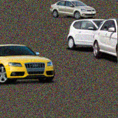
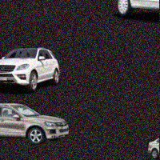
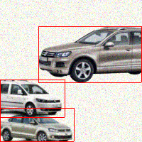
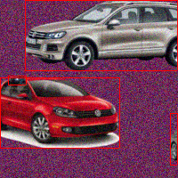
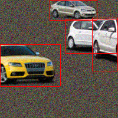
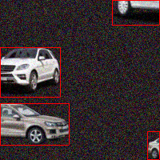

# Moving sprites dataset

This repo contains generator for a image/video dataset
comprising of sprites randomly moving and resizing.
Dataset was created in order to provide simple
task for object localization in images and video and
used in
[github.com/JakubPetriska/moving-sprites-object-detection](https://github.com/JakubPetriska/moving-sprites-object-detection).

By default generator generates 9000 training frames,
1000 validation frames and 1000 test frames. Size of
each frame is 200x200 pixels. All frames
are consecutive and besides the frames, video sequence
is also produced.

## Generating the dataset
In order to generate the dataset run the `generate.py` script in project root.

```bash
python generate.py
```

## Labels
Labels are stored as bounds of rectangles surrounding
the sprites in labels.csv file generated along with
the dataset. Labels file is a CSV file with ; as a
separator. Note that some elements on the line
are tuples. Each line contains description of
all sprites in one frame and has following format:

```
<frame_index>;<sprites>
```

where `<sprites>` is list of tuples separated by ;.
Each sprite tuple has following format:

```
(<sprite_file_name>, (<top>, <bottom>, <left>, <right>))
```

All rectangle boundaries are relative to top/left edge of frame
respectively.

Code that reads the labels file can be found in `generator.utils`.

## Samples
### Generated images





### Generated images with visualized labels 






## Adjusting the dataset
In order to set various properties such as resolution or
counts of generated images change the constants in `generator.constants`. 


## Environment
Code in this repo works with Python 3.5.2 and following
dependencies (Conda format):
```
dependencies:
- openssl=1.0.2j=0
- pip=9.0.1=py35_1
- python=3.5.2=0
- readline=6.2=2
- setuptools=27.2.0=py35_0
- sqlite=3.13.0=0
- tk=8.5.18=0
- wheel=0.29.0=py35_0
- xz=5.2.2=1
- zlib=1.2.8=3
- pip:
  - h5py==2.6.0
  - keras==1.2.0
  - numpy==1.13.0
  - pillow==3.4.2
  - protobuf==3.1.0.post1
  - pyaml==16.12.2
  - pydot-ng==1.0.0
  - pyparsing==2.1.10
  - pyyaml==3.12
  - scipy==0.18.1
  - six==1.10.0
  - tensorflow==0.12.1
  - theano==0.8.2
  - tqdm==4.14.0
```

## License

    Copyright 2017 Jakub Petriska

    Licensed under the Apache License, Version 2.0 (the "License");
    you may not use this file except in compliance with the License.
    You may obtain a copy of the License at

       http://www.apache.org/licenses/LICENSE-2.0

    Unless required by applicable law or agreed to in writing, software
    distributed under the License is distributed on an "AS IS" BASIS,
    WITHOUT WARRANTIES OR CONDITIONS OF ANY KIND, either express or implied.
    See the License for the specific language governing permissions and
    limitations under the License.